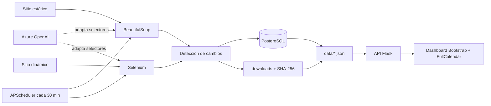

# Plataforma de Scraping, Visualización y Selectores LLM - UTN

Proyecto de Computación en la Nube para la carrera de Ingeniería en Tecnologías
de la Información, ciclo IIC-2026.

## Arquitectura



- `scraper_static.py`: extracción con BeautifulSoup y gestión de archivos.
- `scraper_dynamic.py`: extracción con Selenium y scroll infinito.
- `main.py`: sincronización, cambios, PostgreSQL, logs y JSON.
- `json_api_server.py`: API JSON y servidor del dashboard.
- `llm_selector.py`: generación/adaptación de selectores con Azure OpenAI.
- `scheduler.py`: worker periódico, sin ejecuciones superpuestas.

## Requisitos

- Python 3.9 o superior.
- Google Chrome.
- PostgreSQL.

## Configuración local

Crear `.env` en la raíz. Este archivo está excluido de Git y no se deben
publicar credenciales.

```dotenv
DB_HOST=localhost
DB_PORT=5432
DB_NAME=cloud_scraping_db
DB_USER=postgres
DB_PASSWORD=CAMBIAR

AZURE_OPENAI_ENDPOINT=https://voiceflip-openai.openai.azure.com/
AZURE_OPENAI_KEY=CAMBIAR
AZURE_OPENAI_VERSION=2024-12-01-preview
AZURE_OPENAI_DEPLOYMENT=gpt-4o-mini
ENABLE_LLM_SELECTOR=false

STATIC_SCRAPER_URL=https://books.toscrape.com
DYNAMIC_SCRAPER_URL=https://webscraper.io/test-sites/e-commerce/scroll/computers/laptops
SCHEDULER_MINUTES=30
FLASK_HOST=127.0.0.1
FLASK_PORT=5000
FLASK_DEBUG=false
MAX_DOWNLOAD_BYTES=26214400
```

`ENABLE_LLM_SELECTOR=true` activa Azure OpenAI únicamente cuando los
selectores conocidos dejan de encontrar productos, evitando llamadas y costos
innecesarios.

## Instalación

```bash
python -m venv venv
```

Windows:

```powershell
venv\Scripts\Activate.ps1
pip install -r requirements.txt
```

Crear la base de datos vacía:

```powershell
createdb -U postgres cloud_scraping_db
```

También se puede restaurar el respaldo incluido:

```powershell
pg_restore -U postgres -d cloud_scraping_db --clean --if-exists cloud_scraping_db.backup
```

## Ejecución

Ejecutar una extracción completa:

```powershell
python main.py
```

Iniciar API y dashboard:

```powershell
python api/json_api_server.py
```

Abrir `http://127.0.0.1:5000`.

Iniciar el worker automático:

```powershell
python scheduler.py
```

El intervalo predeterminado es de 30 minutos. Puede configurarse con
`SCHEDULER_MINUTES`; use `60` si se requiere ejecución cada hora.

## Pruebas

Pruebas unitarias:

```powershell
python -m unittest discover -s tests -v
```

Pruebas unitarias más integración PostgreSQL en un esquema temporal:

```powershell
$env:RUN_DB_TESTS="1"
python -m unittest discover -s tests -v
```

La prueba de integración revierte su transacción y no altera las tablas de
entrega.

## Detección de cambios

- Registro nuevo: inserción en PostgreSQL y evento.
- Registro modificado: actualización y evento.
- Registro ausente: eliminación en PostgreSQL y evento.
- Archivo nuevo: descarga, hash SHA-256 y alta.
- Hash diferente: reemplazo local y actualización.
- Archivo local eliminado: restauración desde el origen.
- Archivo ausente en el origen: eliminación local y en PostgreSQL.
- Fuente fallida o bloqueada: no se eliminan datos previos.

Cada ejecución actualiza `data/results.json`, `data/files.json`,
`data/events.json` y `logs/scraper.log`.

## Estructura

```text
.
├── api/
│   └── json_api_server.py
├── data/
│   ├── results.json
│   ├── files.json
│   └── events.json
├── docs/
│   └── guia_inicio.md
├── downloads/
├── frontend/
│   ├── index.html
│   ├── styles.css
│   ├── main.js
│   ├── results.js
│   ├── files.js
│   └── calendar.js
├── llm/
│   └── llm_selector.py
├── logs/
│   └── scraper.log
├── scraper/
│   ├── scraper_dynamic.py
│   └── scraper_static.py
├── tests/
│   └── test_scraping.py
├── cloud_scraping_db.backup
├── cloud_scraping_db.sql
├── main.py
├── scheduler.py
├── requirements.txt
├── .env
└── README.md
```

## API JSON

- `GET /api/status`
- `GET /api/results`
- `GET /api/files`
- `GET /api/events`
- `GET /downloads/<nombre>`

Los endpoints entregan `status`, `count`, `generated_at` y `data`.
